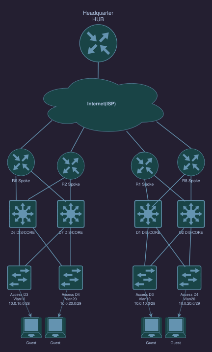

# CCNP Enterprise – Multi-Site DMVPN Branch Edge  
**100% Ansible-Automated Overlay + Conditional Internet Breakout**

9 × CSR1000v (IOS-XE 17.3) | GNS3 | Dual-VRF 

## Real-World Design Highlights
- Dual-VRF architecture (`site_1` / `site_1_2` overlay + `underlay`)
- DMVPN Phase 3 + multipoint GRE over Internet
- Full IPsec IKEv2 protection with per-spoke pre-shared keys (Jinja2 templated)
- BGP overlay (eBGP multihop over loopbacks) 
- Conditional Internet breakout without a single PBR statement  
  → Specific routes exist → traffic goes via DMVPN tunnel  
  → No specific route → single-line default-route leak → NAT → direct ISP breakout

Everything in the overlay is deployed by Ansible – zero manual CLI:

| Component                     | Deployed by Ansible Role/Playbook               | Templated |
|-------------------------------|--------------------------------------------------|-----------|
| L3 interfaces & VRFs          | `roles/l3_interfaces`                            | Yes       |
| DMVPN mGRE tunnels            | `roles/crypto` → `dmvpn_mgre.j2`                 | Yes       |
| Full IPsec IKEv2 suite (proposal/policy/keyring/profile/transform-set) | `roles/crypto` → `ipsec.j2` | Yes       |
| Tunnel protection             | `roles/crypto`                                   | Yes       |
| OSPF (underlay + overlay)     | `roles/ospf_role`                                | Yes       |
| BGP overlay peers             | `roles/bgp` → `neighbor.j2`                      | Yes       |
| VRF-aware NAT + default-route leak | `playbooks/main.yml`                        | Yes       |
| Post-deployment config backup | `playbooks/small_tasks/wr+save_backup.yml`       | –         |

├── ansible.cfg
├── backups/                              → running-config after every deployment
│   ├── R1.EITAN.COM/running_config.txt
│   ├── R2.EITAN.COM/running_config.txt
│   └── ... (all 9 routers + switches)
├── group_vars/all.yml
├── hosts
├── host_vars/                            → per-device variables
├── inventory.yml
├── playbooks/
│   ├── main.yml                          → master playbook
│   ├── informational/                    → fact gathering & debugging playbooks
│   └── small_tasks/
│       ├── no_domain_lookup.yml
│       ├── radi_tacacs_timeout.yml
│       ├── use_gather_to_config_p2p.yml
│       └── wr+save_backup.yml
├── roles/
│   ├── bgp/          → neighbor.j2
│   ├── crypto/       → dmvpn_mgre.j2 + ipsec.j2 (full IKEv2 suite)
│   ├── l3_interfaces/→ l3_interfaces.j2
│   └── ospf_role/    → ospf.j2
└── templates/        → all Jinja2 templates

